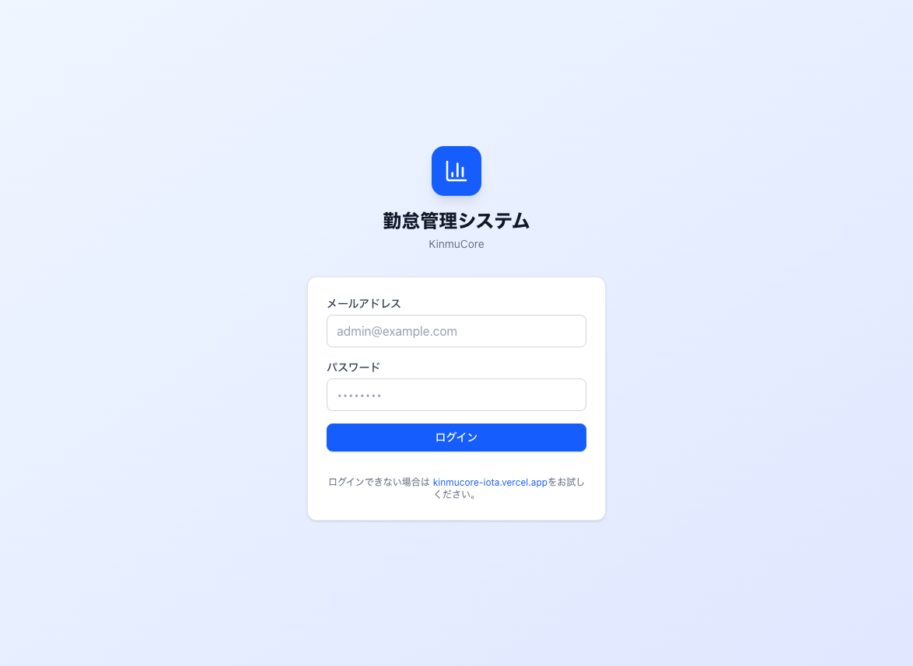

# KinmuCore 操作マニュアル

**バージョン:** 1.0  
**最終更新:** 2026年3月  
**本番環境URL:** https://kinmucore-iota.vercel.app

---

## 目次

1. [はじめに](#はじめに)
2. [STEP 01 ログイン](#step-01-ログイン)
3. [STEP 02 管理者の基本操作](#step-02-管理者の基本操作)
4. [STEP 03 スタッフの基本操作](#step-03-スタッフの基本操作)
5. [STEP 04 打刻の方法](#step-04-打刻の方法)
6. [STEP 05 シフト管理](#step-05-シフト管理)
7. [STEP 06 勤怠・データ出力](#step-06-勤怠データ出力)
8. [よくある質問](#よくある質問)

---

## はじめに

KinmuCoreは薬局向けのクラウド勤怠管理システムです。

### 主な機能

- ✅ タブレットから簡単打刻（2タップで完了）
- ✅ シフト・勤怠記録の管理
- ✅ スタッフ・店舗の一元管理
- ✅ 有給申請・承認
- ✅ Excel/CSV形式での出力

### 役割別の見られる画面

| 役割 | 見られる画面 |
|------|--------------|
| **管理者** | 勤怠管理、シフト、スタッフ、店舗管理、ポリシー、ユーザー管理、データ出力 |
| **スタッフ** | シフト、打刻 |

---

## STEP 01 ログイン

### ❶ ログイン画面を開く

1. ブラウザで **https://kinmucore-iota.vercel.app** にアクセス
2. 自動的にログイン画面に遷移します



### ❷ 認証情報を入力

1. 管理者から受け取った **メールアドレス** を入力
2. **パスワード** を入力
3. 「**ログイン**」ボタンをクリック

### ❸ ログイン後

- **管理者**の場合 → 勤怠管理画面（またはシフト画面）に遷移
- **スタッフ**の場合 → シフト画面に遷移

> 💡 **ポイント！** スマホでは左上の「≡」メニューから各画面に移動できます。

> ⚠️ **注意！** ログインできない場合は、接続環境やURL（kinmucore-iota.vercel.app）をご確認ください。

---

## STEP 02 管理者の基本操作

### ❶ サイドバー（メニュー）の見方

PCでは画面左側にメニューが表示されます。

- **勤怠管理** … 日別の勤怠記録を確認・修正
- **シフト** … シフト表の作成・編集、有給申請の承認
- **スタッフ** … 従業員の登録・編集
- **店舗管理** … 店舗の登録・編集
- **ポリシー** … 就業ルールの設定
- **ユーザー管理** … ログインユーザーの作成・権限設定
- **データ出力** … Excel/CSV形式で勤怠データを出力

### ❷ スマホでの操作

1. 画面上部の **「≡」メニュー** をタップ
2. 左からスライドするメニューが開く
3. 行きたい画面をタップ

---

## STEP 03 スタッフの基本操作

スタッフ権限の方は **シフト** と **打刻** のみ利用できます。

### ❶ シフト画面

- 自分のシフト表を確認できます
- 有給申請もここから行います

### ❷ 打刻画面への移動

1. メニューから「**打刻**」をタップ
2. 店舗を選択して「**打刻画面を開く**」をタップ
3. 打刻専用画面が開きます

### ❸ シフトに戻る（スマホ）

- 打刻画面の **青い「シフトに戻る」バー** をタップ
- 打刻選択画面の **「シフトに戻る」** リンクをタップ

---

## STEP 04 打刻の方法

店舗のタブレットまたはスマホで打刻します。

### ❶ 基本の流れ

1. **自分の名前をタップ**
2. 表示されるボタンから操作を選んでタップ

### ❷ 打刻の種類

| 打刻 | いつ押すか |
|------|------------|
| **出勤** | 出勤したとき |
| **休憩開始** | 休憩に入るとき |
| **休憩終了** | 休憩から戻ったとき |
| **退勤** | 退勤するとき |

### ❸ 1日の例

```
09:00  出勤打刻
  ↓
12:00  休憩開始打刻
  ↓
13:00  休憩終了打刻
  ↓
18:00  退勤打刻
```

> 💡 **ポイント！** 画面に「〇〇を記録しました」と表示されたら完了です。

> ⚠️ **注意！** 正しい順序で打刻してください。出勤していないと休憩開始は押せません。

---

## STEP 05 シフト管理

### ❶ シフト表の確認

1. メニューから「**シフト**」をクリック
2. 年月・店舗で表示を切り替え

### ❷ 有給申請（スタッフ）

1. シフト画面で「**有給申請**」をクリック
2. 日付と種別（1日/半日）を選択
3. 申請を送信

### ❸ 有給の承認（管理者）

1. シフト画面上部の **申請通知バナー** を確認
2. 「**承認**」または「**却下**」をクリック

---

## STEP 06 勤怠・データ出力

### ❶ 勤怠記録の確認

1. メニューから「**勤怠管理**」をクリック
2. 年月・店舗・スタッフで絞り込み

### ❷ データ出力（Excel/CSV）

1. メニューから「**データ出力**」をクリック
2. 年月・店舗・スタッフを指定
3. 「**Excel出力**」または「**CSV出力**」をクリック
4. ダウンロードされたファイルを開く

---

## よくある質問

### Q1. ログインできない

**A:** メールアドレスとパスワードを確認してください。大文字・小文字も含めて正確に入力する必要があります。

---

### Q2. 打刻を忘れた

**A:** 店長または管理者に連絡してください。手動で勤怠記録を登録できます。

---

### Q3. 打刻画面で自分の名前が表示されない

**A:** 店舗が正しいか確認し、画面を下にスクロールして探してください。見つからない場合は管理者に連絡してください。

---

### Q4. スマホでシフト画面に戻れない

**A:** 打刻画面の青い「**シフトに戻る**」バーをタップするか、打刻選択画面の「**シフトに戻る**」リンクをタップしてください。

---

### Q5. データが表示されない

**A:** 年月の選択、店舗・スタッフのフィルタを確認し、ページを再読み込みしてみてください。

---

**KinmuCore 操作マニュアル 終わり**
